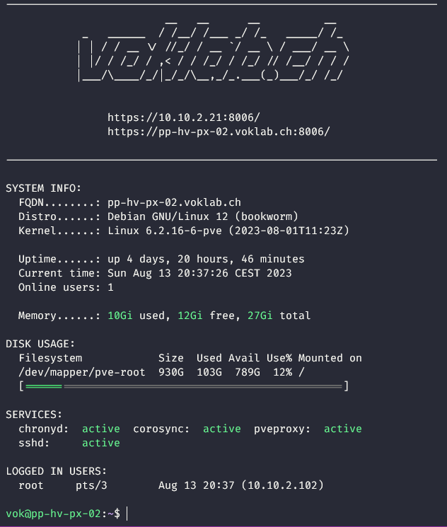

Description
=====
My MOTD scripts for my Proxmox nodes

A modified version of [yboetz's](https://github.com/yboetz/motd) MOTD from GitHub

Preview
=====

Requirements
=====
For the banner to work, you only need the "figlet" package.
Simply install it on your proxmox nodes with:

    sudo apt install figlet -y

Installation
=====
On your proxmox nodes, clone all the scripts inside the `/etc/update-motd.d/` directory

Set `PrintMotd` to `no` inside your `/etc/ssh/sshd_config`
